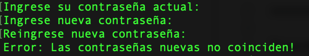

Evaluación de Diagnóstico
=========================

Se solicita realizar un validador de contraseñas. El usuario deberá ingresar la contraseña dos veces, la cual debe cumplr con las siguientes condiciones:

- La contraseña nueva no puede ser igual a la actual, y la nueva contraseña debe solicitarla dos veces las cuales deben ser iguales.
- Se pide crear una clase Login.
- Método validaPass1(): Verifica que las contraseñas nuevas sean iguales.
- Método validaPass2(): Verifica que la contraseña nueva no sea igual a la actual.
- Implementar método main() la llamada a los métodos.

La clase implementa java.io.Console, por lo que sólo acepta ejecuciones desde una terminal (shell/cmd/etc).

Para compilar considere:

  $ javac Login.java

Para su ejecución:

  $ java Login
